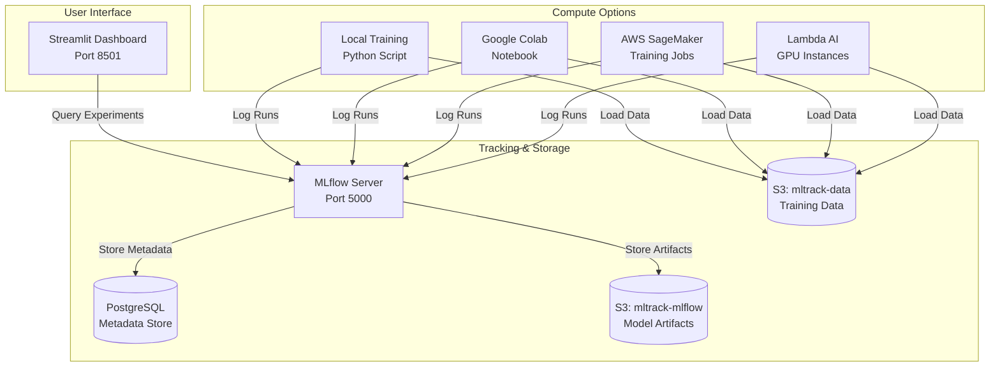
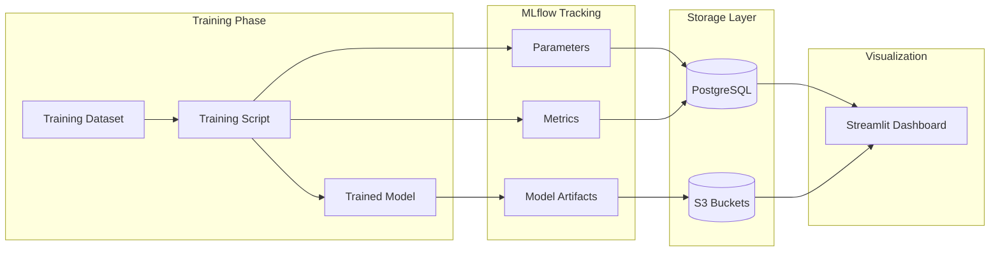
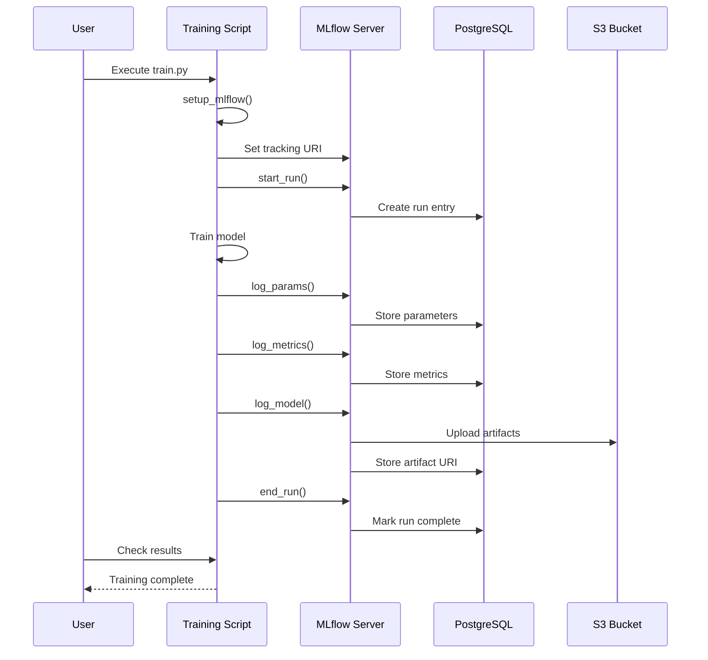
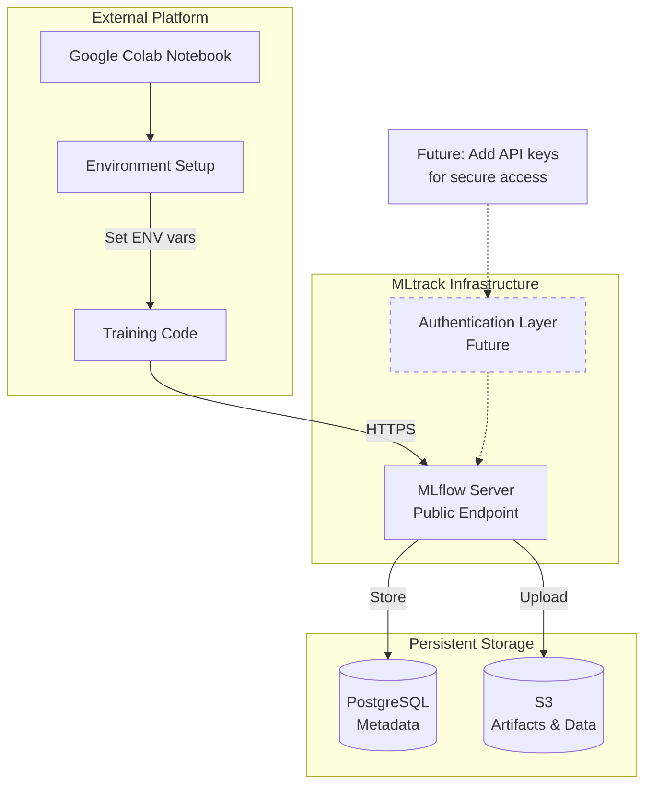
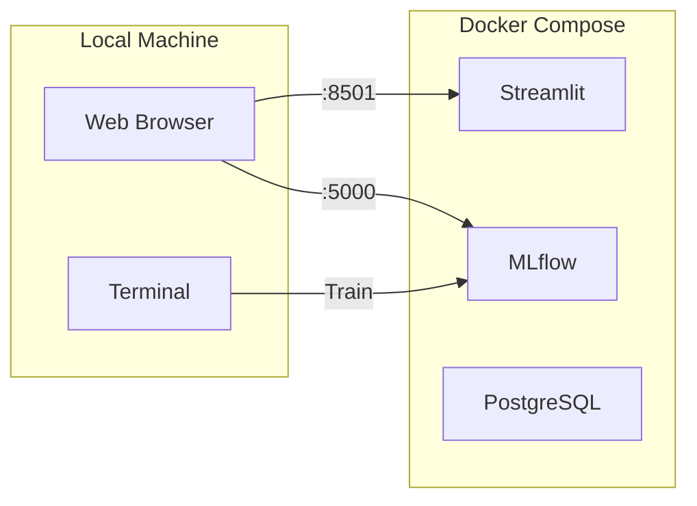
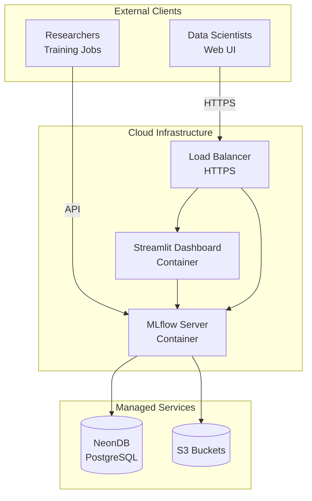
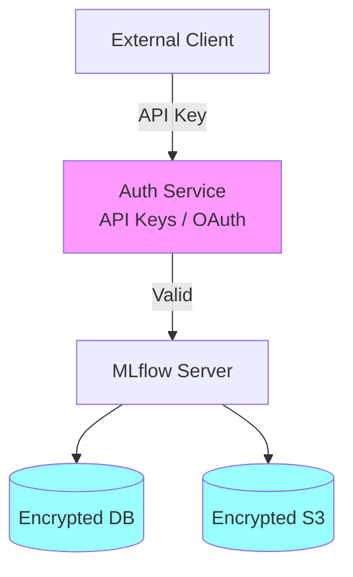
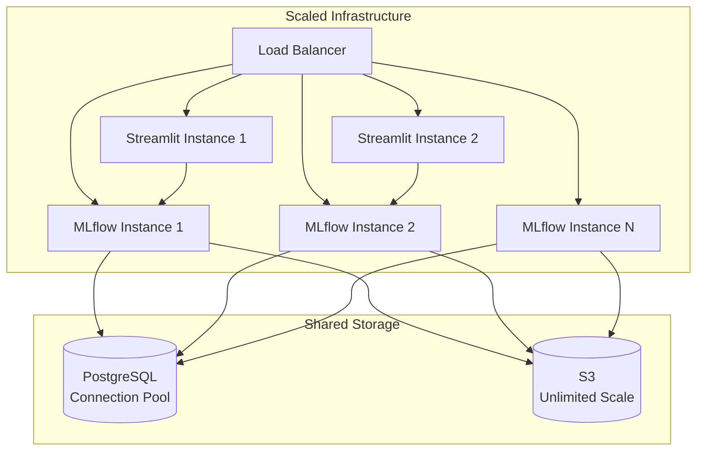

# MLtrack Architecture Documentation

This document provides detailed architecture diagrams for the MLtrack system.

## Component Diagram



## Data Flow Diagram



## Training Run Sequence Diagram



## External Compute Integration Pattern



## Deployment Patterns

### Local Development



### Production Deployment



## Security Considerations

### Current State (MVP)

- No authentication on MLflow server
- Basic S3 IAM credentials
- Local development only

### Future Enhancements



Planned security features:
- API key authentication for MLflow
- OAuth integration for Streamlit dashboard
- Encrypted database connections
- S3 bucket encryption at rest
- VPC isolation for production
- Audit logging

## Scaling Considerations

### Current Capacity
- Single MLflow server instance
- Single Streamlit instance
- PostgreSQL container (local) or NeonDB (production)

### Future Scaling Options



## Technology Stack Details

| Component | Technology | Purpose |
|-----------|-----------|---------|
| Experiment Tracking | MLflow | Track parameters, metrics, models |
| Backend Storage | PostgreSQL | Store experiment metadata |
| Artifact Storage | AWS S3 | Store model artifacts and datasets |
| Dashboard | Streamlit | Visualize and compare experiments |
| Containerization | Docker Compose | Local development environment |
| Package Manager | uv | Fast Python dependency management |
| Linting | Ruff | Code quality and formatting |
| Testing | pytest | Unit and integration tests |
| CI/CD | GitHub Actions | Automated testing and validation |

## Directory Structure Rationale

```
mltrack/
├── src/mltrack/                    # Installable Python package (src layout)
│   ├── __init__.py
│   ├── config.py                   # Centralized configuration management
│   ├── logger.py                   # Logging utilities
│   ├── loaders.py                  # Data loading abstraction (DataLoader base, IrisLoader)
│   ├── models.py                   # Model registry (get_model, list_models)
│   ├── pipelines.py                # Pipeline orchestration (TrainingPipeline, run_pipeline)
│   ├── storage.py                  # S3 storage handler (S3Storage, get_storage)
│   ├── train.py                    # Standalone training script (demo)
│   └── main.py                     # Main entry point (if available)
├── streamlit/                      # Separate service, own dependencies
│   ├── app.py                      # Main dashboard application
│   ├── data.py                     # Data retrieval utilities
│   ├── Dockerfile                  # Isolated container
│   └── __init__.py
├── mlflow/                         # Separate service
│   ├── Dockerfile                  # MLflow server container
│   └── entrypoint.sh               # Container entrypoint
├── tests/                          # Test suite
│   └── test_imports.py             # Package import tests
├── docs/                           # Architecture documentation
│   └── architecture.md             # Detailed diagrams and design rationale
├── pyproject.toml                  # Project configuration (uv)
└── docker-compose.yml              # Local development stack
```

### Module Details

#### Core Modules

**`loaders.py`** - Data loading abstraction
- `DataLoader` (ABC): Base class for all loaders
- `IrisLoader`: Built-in Iris dataset loader
- `get_loader(name)`: Factory function for loader instances

**`models.py`** - Model registry
- `MODELS`: Registry dict with model classes and default parameters
- `get_model(name, **kwargs)`: Get configured model instance
- `list_models()`: List available models

**`pipelines.py`** - Pipeline orchestration
- `TrainingPipeline`: Configuration dataclass
- `train_single_model()`: Train one model with MLflow logging
- `run_pipeline()`: Execute complete training pipeline

**`storage.py`** - S3 storage handler
- `S3Storage`: Handler for save/load operations
- `save_preprocessed()`, `load_preprocessed()`: Data serialization
- `save_model()`, `load_model()`: Model persistence
- `get_storage()`: Factory function

#### Utility Modules

**`config.py`** - Configuration management
- `MLtrackConfig`: Dataclass for environment variables
- `setup_mlflow()`: Initialize MLflow server connection

**`logger.py`** - Logging utilities
- `get_logger(name)`: Get configured logger (respects ENV variable)

#### Entry Points

**`train.py`** - Standalone demo
- Direct model training with MLflow autolog
- Iris dataset + three classifiers (LogisticRegression, RandomForest, SVM)
- Works offline if needed

**`main.py`** - Modular entry point (optional)
- Uses pipelines module for orchestrated training
- Demonstrates composable architecture

**Design decisions:**
- **Src layout**: Prevents accidental imports from project root
- **Module separation**: Each concern (loading, modeling, pipeline) isolated
- **Registry pattern**: Flexible model/loader registration without hardcoding
- **Abstract base classes**: Extensible architecture for custom loaders/models
- **Standalone compatibility**: train.py works without external setup
- **MLflow integration**: Autolog for automatic parameter/metric tracking

## Extending the Architecture

### Adding a Custom Data Loader

Create a new loader by implementing the `DataLoader` interface:

```python
# In loaders.py
class CustomDataLoader(DataLoader):
    """Loader for custom dataset."""

    def load(self) -> tuple[np.ndarray, np.ndarray, list[str], list[str]]:
        """Load your data."""
        # Load X, y, feature_names, target_names
        return X, y, feature_names, target_names

# Register in loaders.py get_loader()
loaders = {
    "iris": IrisLoader,
    "custom": CustomDataLoader,  # Add here
}
```

Usage:
```bash
uv run python -m mltrack.main --loader custom
```

### Adding a Custom Model

Register new sklearn models in the models registry:

```python
# In models.py
MODELS: dict[str, tuple[type[ClassifierMixin], dict[str, Any]]] = {
    "logistic_regression": (...),
    "random_forest": (...),
    "custom_model": (
        CustomClassifier,
        {"param1": value1, "param2": value2}
    ),
}
```

Usage:
```bash
uv run python -m mltrack.main --models custom_model logistic_regression
```

### Integration Points

**No code changes needed for:**
- Adding MLflow tracking parameters → autolog handles it
- Changing hyperparameters → use `--models custom_model --extra-params` (if implemented)
- Different S3 buckets → environment variables in `.env`
- Custom logging levels → `ENV=local` for debug logging

**Requires code changes for:**
- New data sources → New DataLoader implementation
- New model types → Register in MODELS dict
- Custom pipeline logic → Extend TrainingPipeline class or create new pipeline function
