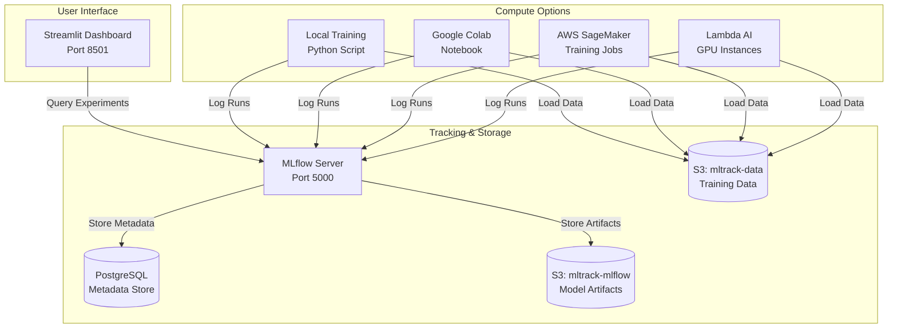
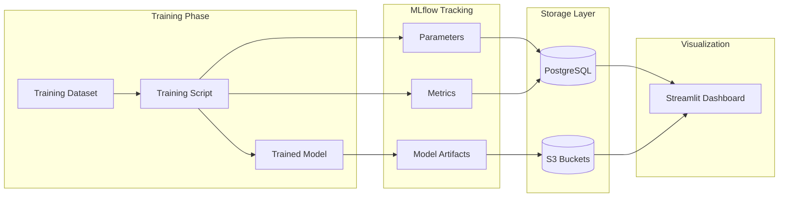
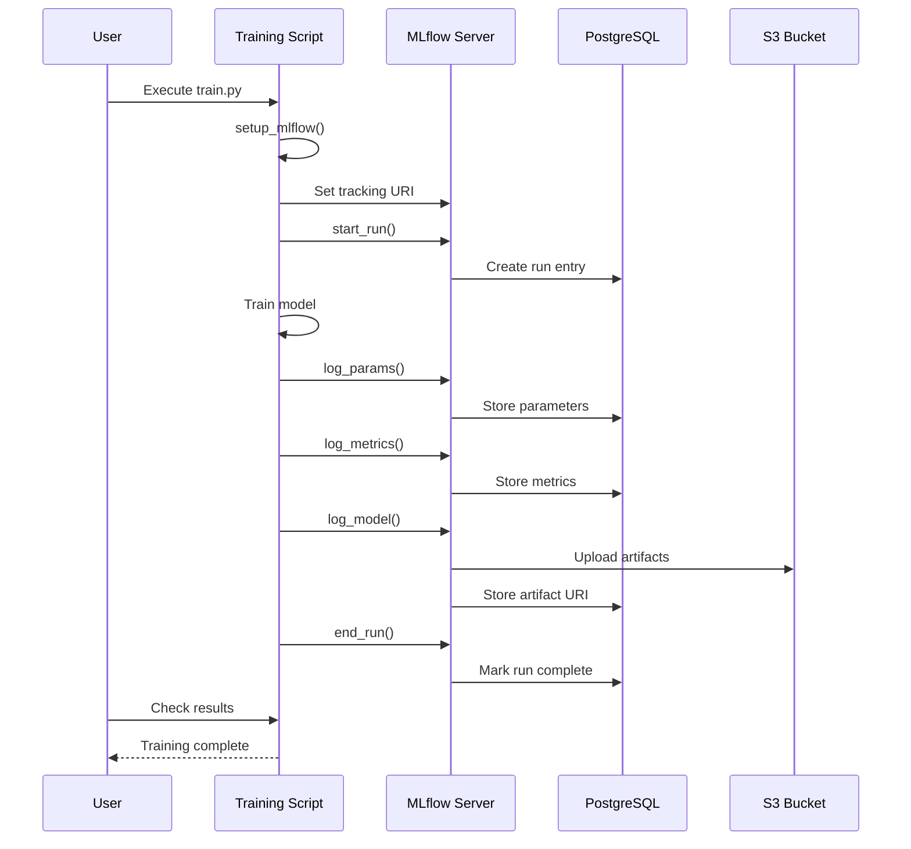
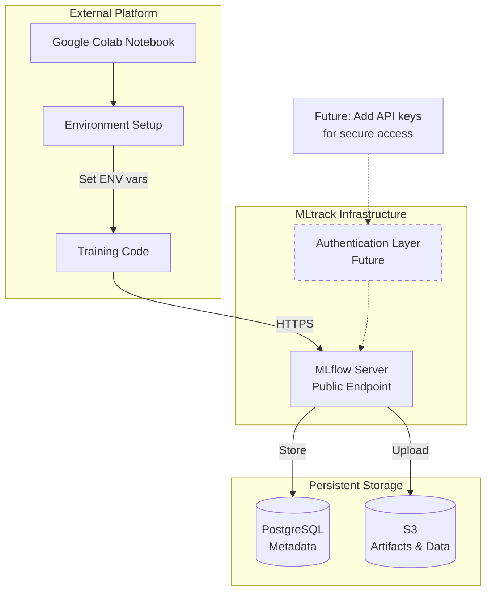
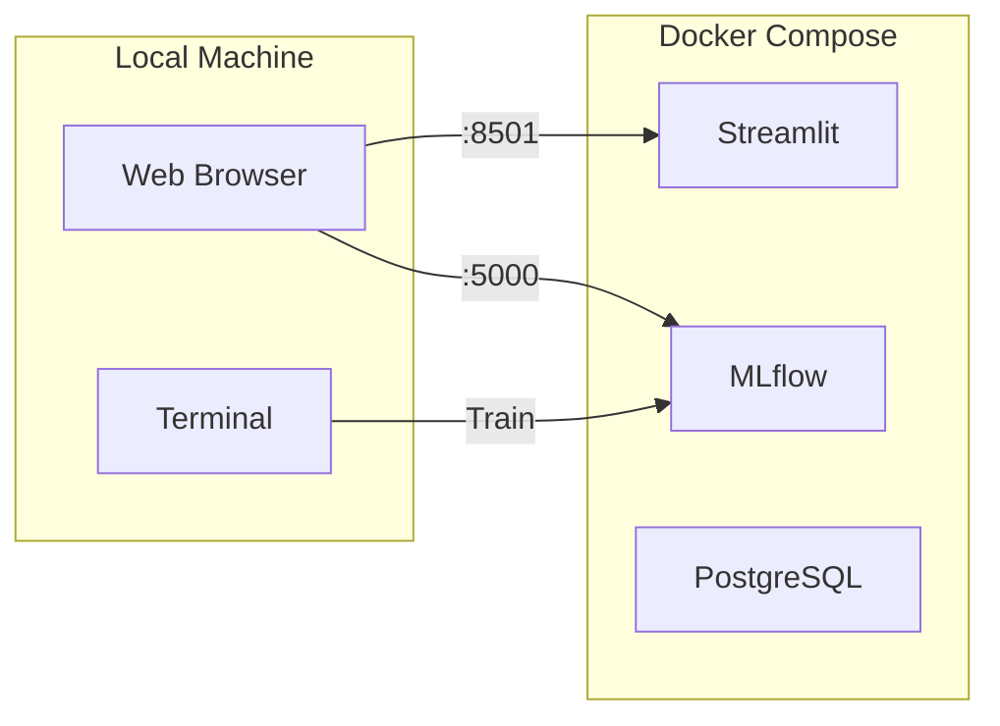
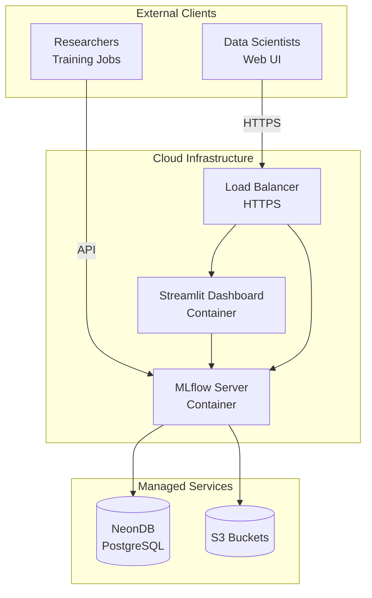
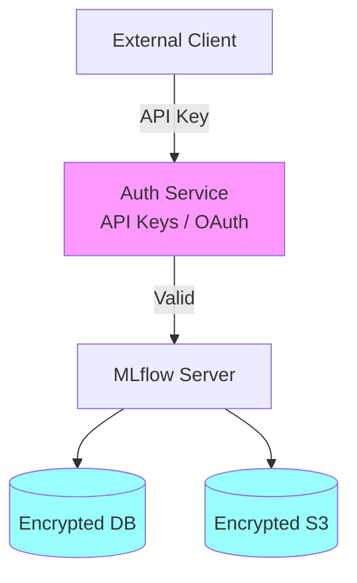
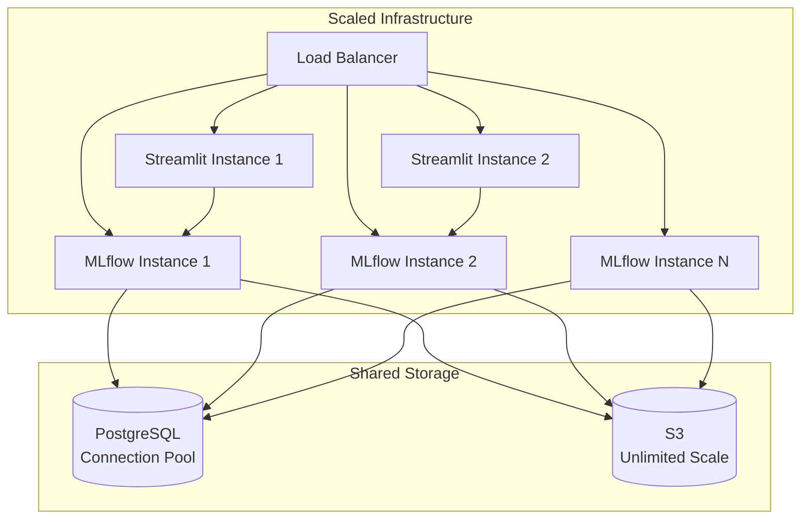

# MLtrack Architecture Documentation

This document provides detailed architecture diagrams for the MLtrack system.

## Component Diagram



## Data Flow Diagram



## Training Run Sequence Diagram



## External Compute Integration Pattern



## Deployment Patterns

### Local Development



### Production Deployment



## Security Considerations

### Current State (MVP)

- No authentication on MLflow server
- Basic S3 IAM credentials
- Local development only

### Future Enhancements



Planned security features:
- API key authentication for MLflow
- OAuth integration for Streamlit dashboard
- Encrypted database connections
- S3 bucket encryption at rest
- VPC isolation for production
- Audit logging

## Scaling Considerations

### Current Capacity
- Single MLflow server instance
- Single Streamlit instance
- PostgreSQL container (local) or NeonDB (production)

### Future Scaling Options



## Technology Stack Details

| Component | Technology | Purpose |
|-----------|-----------|---------|
| Experiment Tracking | MLflow | Track parameters, metrics, models |
| Backend Storage | PostgreSQL | Store experiment metadata |
| Artifact Storage | AWS S3 | Store model artifacts and datasets |
| Dashboard | Streamlit | Visualize and compare experiments |
| Containerization | Docker Compose | Local development environment |
| Package Manager | uv | Fast Python dependency management |
| Linting | Ruff | Code quality and formatting |
| Testing | pytest | Unit and integration tests |
| CI/CD | GitHub Actions | Automated testing and validation |

## Directory Structure Rationale

```
mltrack/
├── src/mltrack/           # Installable Python package (src layout)
│   ├── config.py          # Centralized configuration management
│   └── train.py           # Standalone training script
├── streamlit/             # Separate service, own dependencies
│   ├── Dockerfile         # Isolated container
│   └── app.py            # Dashboard application
├── mlflow/                # Separate service
│   └── Dockerfile        # MLflow server container
├── requirements/          # Split by service for minimal images
│   ├── base.txt          # Common dependencies
│   ├── mlflow.txt        # MLflow server only
│   ├── streamlit.txt     # Dashboard only
│   └── dev.txt           # Development tools
├── tests/                 # Test suite
└── docs/                  # Architecture documentation
```

**Design decisions:**
- **Src layout**: Prevents accidental imports from project root
- **Split requirements**: Minimize Docker image sizes
- **Service isolation**: Each service has independent dependencies
- **Standalone training**: Training script works anywhere with config
